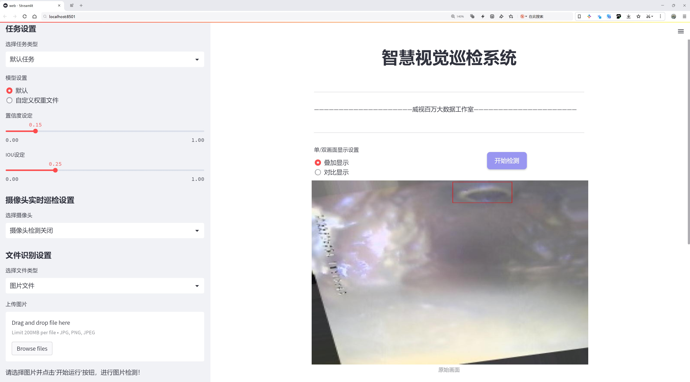

# 管道缺陷检测检测系统源码分享
 # [一条龙教学YOLOV8标注好的数据集一键训练_70+全套改进创新点发刊_Web前端展示]

### 1.研究背景与意义

项目参考[AAAI Association for the Advancement of Artificial Intelligence](https://gitee.com/qunshansj/projects)

项目来源[AACV Association for the Advancement of Computer Vision](https://gitee.com/qunmasj/projects)

研究背景与意义

随着城市化进程的加快，地下管道系统的维护与管理日益成为城市基础设施管理的重要组成部分。管道的安全性和可靠性直接影响到城市的供水、排水以及其他重要功能的正常运作。然而，管道在长期使用过程中，常常会出现各种缺陷，如根部堵塞、结垢、接头损坏、管道表面损伤、形状变形、污泥积累和石块嵌入等。这些缺陷不仅影响管道的流通效率，还可能导致严重的环境污染和经济损失。因此，及时、准确地检测和评估管道缺陷，对于保障城市的正常运作和公共安全具有重要意义。

传统的管道检测方法多依赖人工巡检和简单的视觉检查，这不仅效率低下，而且容易受到人为因素的影响，导致漏检和误判。随着计算机视觉和深度学习技术的快速发展，基于图像识别的自动化检测方法逐渐成为管道缺陷检测的研究热点。YOLO（You Only Look Once）系列模型以其高效的实时目标检测能力，已被广泛应用于各类物体检测任务中。YOLOv8作为该系列的最新版本，具备更强的特征提取能力和更快的处理速度，为管道缺陷检测提供了新的技术手段。

本研究旨在基于改进的YOLOv8模型，构建一个高效的管道缺陷检测系统。我们使用的数据集包含1900张图像，涵盖了8类管道缺陷，包括根部堵塞、结垢、接头、管道表面损伤、形状变形、污泥积累和石块。这些类别的多样性为模型的训练提供了丰富的样本，有助于提高检测的准确性和鲁棒性。通过对YOLOv8模型的改进，我们将重点优化模型的特征提取网络，以增强其对不同类型缺陷的识别能力，并通过数据增强技术提升模型的泛化能力。

本研究的意义不仅在于推动管道缺陷检测技术的发展，更在于为城市基础设施的智能化管理提供新的解决方案。通过实现自动化的管道缺陷检测，能够大幅提高检测效率，降低人工成本，同时减少因人为因素导致的误判。此外，基于深度学习的检测系统还可以实现实时监控，为管道的日常维护和突发事件的快速响应提供有力支持。

综上所述，基于改进YOLOv8的管道缺陷检测系统的研究，不仅具有重要的理论价值，也具备广泛的应用前景。随着技术的不断进步，该系统有望在未来的城市管理中发挥更为重要的作用，为建设智慧城市贡献力量。通过本研究，我们希望能够为管道检测领域提供新的思路和方法，推动相关技术的进步与应用，为城市的可持续发展奠定基础。

### 2.图片演示




##### 注意：由于此博客编辑较早，上面“2.图片演示”和“3.视频演示”展示的系统图片或者视频可能为老版本，新版本在老版本的基础上升级如下：（实际效果以升级的新版本为准）

  （1）适配了YOLOV8的“目标检测”模型和“实例分割”模型，通过加载相应的权重（.pt）文件即可自适应加载模型。

  （2）支持“图片识别”、“视频识别”、“摄像头实时识别”三种识别模式。

  （3）支持“图片识别”、“视频识别”、“摄像头实时识别”三种识别结果保存导出，解决手动导出（容易卡顿出现爆内存）存在的问题，识别完自动保存结果并导出到tempDir中。

  （4）支持Web前端系统中的标题、背景图等自定义修改，后面提供修改教程。

  另外本项目提供训练的数据集和训练教程,暂不提供权重文件（best.pt）,需要您按照教程进行训练后实现图片演示和Web前端界面演示的效果。

### 3.视频演示

[3.1 视频演示](https://www.bilibili.com/video/BV1C3tjemE2j/)

### 4.数据集信息展示

##### 4.1 本项目数据集详细数据（类别数＆类别名）

nc: 8
names: ['Root_blockage', 'encrustation', 'ferrule', 'joint', 'pipe_surface_damage', 'shape_deformation', 'sluge accumulation', 'stone']


##### 4.2 本项目数据集信息介绍

数据集信息展示

在本研究中，我们使用了名为“kapilproject”的数据集，以改进YOLOv8在管道缺陷检测系统中的应用。该数据集专门针对管道检测领域，包含了多种类型的缺陷样本，旨在为深度学习模型提供丰富的训练数据，从而提高其在实际应用中的检测精度和可靠性。该数据集的类别数量为8，涵盖了管道中常见的缺陷类型，具体包括：根部堵塞（Root_blockage）、结垢（encrustation）、法兰（ferrule）、接头（joint）、管道表面损伤（pipe_surface_damage）、形状变形（shape_deformation）、污泥积累（sluge accumulation）以及石块（stone）。

每个类别的样本都经过精心标注，确保数据的准确性和一致性。这些样本不仅包括各种管道材质和直径的图像，还涵盖了不同的拍摄角度和光照条件，以增强模型的泛化能力。例如，根部堵塞的样本展示了植物根系如何在管道内生长并导致流动受阻，而结垢则表现为管道内壁的矿物沉积，可能影响水流的效率。法兰和接头的样本则提供了连接部分的细节，帮助模型识别这些关键部位的潜在缺陷。

管道表面损伤的样本则记录了因腐蚀、磨损或外部冲击导致的表面问题，这些损伤可能会影响管道的整体结构和功能。形状变形的样本则展示了由于压力或其他外力导致的管道形状变化，这类缺陷在早期检测中尤为重要，因为它们可能预示着更严重的结构问题。污泥积累和石块的样本则强调了管道内可能出现的异物，这些异物不仅会影响流动，还可能导致堵塞或其他故障。

通过使用“kapilproject”数据集，我们能够为YOLOv8模型提供一个全面的训练基础，使其能够有效识别和分类这些管道缺陷。在训练过程中，模型将学习到每种缺陷的特征和模式，从而在实际应用中实现快速、准确的检测。数据集的多样性和丰富性将大大提高模型的鲁棒性，使其能够在不同的环境和条件下表现出色。

此外，为了确保模型的训练效果，我们还将采用数据增强技术，以进一步扩展数据集的有效样本数量。这包括旋转、缩放、翻转等操作，旨在模拟现实世界中可能遇到的各种情况。通过这种方式，我们希望提升模型在处理复杂场景时的适应能力，确保其在实际管道检测任务中的有效性。

总之，“kapilproject”数据集为改进YOLOv8的管道缺陷检测系统提供了坚实的基础。通过对8个类别的深度学习，我们期待实现更高效的管道监测和维护，最终为管道管理提供更为可靠的技术支持。


### 5.全套项目环境部署视频教程（零基础手把手教学）

[5.1 环境部署教程链接（零基础手把手教学）](https://www.ixigua.com/7404473917358506534?logTag=c807d0cbc21c0ef59de5)


[5.2 安装Python虚拟环境创建和依赖库安装视频教程链接（零基础手把手教学）](https://www.ixigua.com/7404474678003106304?logTag=1f1041108cd1f708b01a)

### 6.手把手YOLOV8训练视频教程（零基础小白有手就能学会）

[6.1 手把手YOLOV8训练视频教程（零基础小白有手就能学会）](https://www.ixigua.com/7404477157818401292?logTag=d31a2dfd1983c9668658)

### 7.70+种全套YOLOV8创新点代码加载调参视频教程（一键加载写好的改进模型的配置文件）

[7.1 70+种全套YOLOV8创新点代码加载调参视频教程（一键加载写好的改进模型的配置文件）](https://www.ixigua.com/7404478314661806627?logTag=29066f8288e3f4eea3a4)

### 8.70+种全套YOLOV8创新点原理讲解（非科班也可以轻松写刊发刊，V10版本正在科研待更新）

由于篇幅限制，每个创新点的具体原理讲解就不一一展开，具体见下列网址中的创新点对应子项目的技术原理博客网址【Blog】：


[8.1 70+种全套YOLOV8创新点原理讲解链接](https://gitee.com/qunmasj/good)

### 9.系统功能展示（检测对象为举例，实际内容以本项目数据集为准）

图9.1.系统支持检测结果表格显示

  图9.2.系统支持置信度和IOU阈值手动调节

  图9.3.系统支持自定义加载权重文件best.pt(需要你通过步骤5中训练获得)

  图9.4.系统支持摄像头实时识别

  图9.5.系统支持图片识别

  图9.6.系统支持视频识别

  图9.7.系统支持识别结果文件自动保存

  图9.8.系统支持Excel导出检测结果数据


### 10.原始YOLOV8算法原理

原始YOLOv8算法原理

YOLOv8作为YOLO系列的最新版本，代表了目标检测领域的一次重要技术进步。它在设计上继承了前几代YOLO模型的优点，同时引入了一系列创新和改进，使得其在检测精度和速度上都取得了显著提升。YOLOv8的核心架构可以分为四个主要部分：输入端、骨干网络（Backbone）、颈部网络（Neck）和头部网络（Head），每个部分都在实现高效目标检测中发挥着至关重要的作用。

在输入端，YOLOv8采用了马赛克数据增强技术，这种方法通过将多张图像拼接在一起，生成新的训练样本，从而增强了模型的泛化能力。此外，YOLOv8还引入了自适应锚框计算和自适应灰度填充技术，这些技术使得模型能够更好地适应不同场景下的目标检测任务，确保了输入图像的质量和多样性。

骨干网络是YOLOv8的特征提取核心，采用了CSPDarknet结构。这一结构通过将网络分为两个部分，每个部分都包含多个残差块，显著提高了特征提取的效率。相较于YOLOv5，YOLOv8引入了C2f模块，替代了C3模块。C2f模块的设计使得输入特征图被分为两个分支，每个分支通过卷积层进行降维处理，并且在此过程中，Bottleneck层被替换为v8_C2fBottleneck层。这种设计不仅增强了模型的梯度流动性，还提高了特征表示能力，使得模型能够捕捉到更丰富的特征信息。

YOLOv8还引入了快速空间金字塔池化（SPPF）结构，这一特征金字塔网络的改进，使得模型能够有效提取不同尺度的特征。SPPF通过不同内核尺寸的池化操作，合并特征图，减少了模型的参数量和计算量，同时提高了特征提取的效率。这种高效的特征提取机制，为后续的目标检测提供了坚实的基础。

在颈部网络部分，YOLOv8采用了路径聚合网络（PAN）结构，这一结构通过多个卷积层和池化层的组合，增强了网络对不同缩放尺度对象的特征融合能力。PAN的设计使得语义特征和定位特征能够更好地进行转移，从而提升了模型对复杂场景的适应能力。这一部分的优化，使得YOLOv8在处理多尺度目标时表现得更加出色。

头部网络是YOLOv8的最终检测模块，它将分类和检测过程进行了解耦，主要包括损失计算和目标检测框筛选。YOLOv8采用了一种基于无锚框（Anchor-Free）的检测方式，直接预测目标的中心点和宽高比例。这一创新设计显著减少了锚框的数量，提升了检测速度和准确度。损失计算过程采用了Task-Aligned Assigner分配策略，根据分类与回归的分数加权结果选择正样本，确保了模型在训练过程中的高效性。

在损失计算方面，YOLOv8结合了二元交叉熵损失（BCELoss）和分布焦点损失（DFLoss）以及完全交并比损失函数（CIOULoss），以提升模型对边界框预测的精准性。这种多样化的损失函数设计，使得YOLOv8在处理复杂目标时，能够更好地优化模型性能。

总体而言，YOLOv8在设计上充分考虑了模型的实时性和轻量化需求，通过一系列的结构优化和算法改进，提升了目标检测的准确度和速度。其高效的特征提取机制、强大的特征融合能力以及创新的无锚框检测方式，使得YOLOv8在目标检测领域中展现出了强大的竞争力。随着YOLOv8的广泛应用，目标检测技术将进一步向着更高的精度和更快的速度发展，为实际应用提供更加可靠的技术支持。


### 11.项目核心源码讲解（再也不用担心看不懂代码逻辑）

#### 11.1 70+种YOLOv8算法改进源码大全和调试加载训练教程（非必要）\ultralytics\utils\callbacks\hub.py

以下是对代码的核心部分进行提炼和详细注释的结果：

```python
# 导入必要的库
import json
from time import time
from ultralytics.hub.utils import HUB_WEB_ROOT, PREFIX, events
from ultralytics.utils import LOGGER, SETTINGS

def on_fit_epoch_end(trainer):
    """在每个训练周期结束时上传训练进度指标。"""
    session = getattr(trainer, 'hub_session', None)  # 获取训练器的会话信息
    if session:
        # 收集训练损失和其他指标
        all_plots = {**trainer.label_loss_items(trainer.tloss, prefix='train'), **trainer.metrics}
        # 如果是第一个周期，添加模型信息
        if trainer.epoch == 0:
            from ultralytics.utils.torch_utils import model_info_for_loggers
            all_plots = {**all_plots, **model_info_for_loggers(trainer)}
        
        # 将当前周期的指标以JSON格式存入队列
        session.metrics_queue[trainer.epoch] = json.dumps(all_plots)
        
        # 检查是否超过上传频率限制
        if time() - session.timers['metrics'] > session.rate_limits['metrics']:
            session.upload_metrics()  # 上传指标
            session.timers['metrics'] = time()  # 重置计时器
            session.metrics_queue = {}  # 重置队列

def on_model_save(trainer):
    """保存检查点到Ultralytics HUB，并遵循速率限制。"""
    session = getattr(trainer, 'hub_session', None)  # 获取训练器的会话信息
    if session:
        is_best = trainer.best_fitness == trainer.fitness  # 判断当前模型是否是最佳模型
        # 检查是否超过上传频率限制
        if time() - session.timers['ckpt'] > session.rate_limits['ckpt']:
            LOGGER.info(f'{PREFIX}上传检查点 {HUB_WEB_ROOT}/models/{session.model_id}')  # 日志记录上传信息
            session.upload_model(trainer.epoch, trainer.last, is_best)  # 上传模型
            session.timers['ckpt'] = time()  # 重置计时器

def on_train_end(trainer):
    """在训练结束时上传最终模型和指标到Ultralytics HUB。"""
    session = getattr(trainer, 'hub_session', None)  # 获取训练器的会话信息
    if session:
        LOGGER.info(f'{PREFIX}同步最终模型...')  # 日志记录同步信息
        # 上传最终模型和指标
        session.upload_model(trainer.epoch, trainer.best, map=trainer.metrics.get('metrics/mAP50-95(B)', 0), final=True)
        session.alive = False  # 停止心跳
        LOGGER.info(f'{PREFIX}完成 ✅\n'
                    f'{PREFIX}查看模型于 {HUB_WEB_ROOT}/models/{session.model_id} 🚀')

# 回调函数字典，包含训练、验证、预测和导出开始时的事件处理
callbacks = {
    'on_fit_epoch_end': on_fit_epoch_end,
    'on_model_save': on_model_save,
    'on_train_end': on_train_end,
} if SETTINGS['hub'] is True else {}  # 验证是否启用
```

### 代码分析与注释
1. **导入部分**：导入了必要的库和模块，主要用于处理时间、JSON格式数据以及Ultralytics相关的工具和设置。
  
2. **`on_fit_epoch_end` 函数**：
   - 在每个训练周期结束时调用，负责收集并上传训练指标。
   - 使用 `session.metrics_queue` 存储当前周期的指标，只有在超过设定的时间限制后才会上传。

3. **`on_model_save` 函数**：
   - 在模型保存时调用，负责将当前模型的检查点上传到Ultralytics HUB。
   - 通过判断当前模型是否是最佳模型来决定上传的内容。

4. **`on_train_end` 函数**：
   - 在训练结束时调用，负责上传最终模型和训练指标。
   - 通过 `session.upload_model` 方法将模型和指标上传，并记录相关日志。

5. **回调函数字典**：根据设置决定是否启用回调函数，主要用于处理训练、验证、预测和导出等不同阶段的事件。

以上是对代码的核心部分提炼和详细注释，帮助理解其功能和逻辑。

这个文件是一个用于Ultralytics YOLO（You Only Look Once）算法的回调函数模块，主要负责在训练、验证和预测过程中与Ultralytics HUB进行交互。文件中定义了一系列的回调函数，这些函数在特定事件发生时被调用，以便记录训练进度、上传模型和指标等。

首先，文件导入了一些必要的库和模块，包括`json`用于处理JSON数据，`time`用于时间管理，以及来自`ultralytics`库的工具和设置。这些导入的模块为后续的功能实现提供了支持。

接下来，定义了多个回调函数。`on_pretrain_routine_end`函数在预训练过程结束时被调用，它的主要作用是记录信息并启动上传速率限制的计时器。如果训练器有与HUB的会话，它会记录模型的访问链接，并初始化计时器。

`on_fit_epoch_end`函数在每个训练周期结束时被调用，负责上传训练进度的指标。它会将训练损失和其他指标合并，并在每个周期结束后上传这些数据。如果当前时间与上次上传的时间间隔超过了速率限制，它会执行上传操作并重置计时器和指标队列。

`on_model_save`函数在模型保存时被调用，负责将检查点上传到Ultralytics HUB。它会检查当前模型是否是最佳模型，并在满足速率限制的情况下上传模型。

`on_train_end`函数在训练结束时被调用，负责上传最终模型和指标。它会记录上传过程，并在完成后停止心跳信号。

此外，还有一些其他的回调函数，如`on_train_start`、`on_val_start`、`on_predict_start`和`on_export_start`，这些函数在训练、验证、预测和导出开始时被调用，主要用于执行与事件相关的操作。

最后，所有的回调函数被组织成一个字典，只有在设置中启用了HUB功能时，这个字典才会被创建。这个设计使得模块的功能可以根据需要进行启用或禁用，从而提高了灵活性。

总体而言，这个文件的主要功能是通过回调机制与Ultralytics HUB进行交互，记录和上传训练过程中的各种信息，确保训练过程的可追踪性和模型的及时更新。

#### 11.2 ui.py

```python
import sys
import subprocess

def run_script(script_path):
    """
    使用当前 Python 环境运行指定的脚本。

    Args:
        script_path (str): 要运行的脚本路径

    Returns:
        None
    """
    # 获取当前 Python 解释器的路径
    python_path = sys.executable

    # 构建运行命令，使用 streamlit 运行指定的脚本
    command = f'"{python_path}" -m streamlit run "{script_path}"'

    # 执行命令
    result = subprocess.run(command, shell=True)
    # 检查命令执行的返回码，如果不为0则表示出错
    if result.returncode != 0:
        print("脚本运行出错。")

# 主程序入口
if __name__ == "__main__":
    # 指定要运行的脚本路径
    script_path = "web.py"  # 这里可以直接指定脚本名，假设在当前目录下

    # 调用函数运行脚本
    run_script(script_path)
```

### 代码核心部分及注释说明：

1. **导入模块**：
   - `sys`：用于访问与 Python 解释器相关的变量和函数。
   - `subprocess`：用于创建新进程、连接到它们的输入/输出/错误管道，并获得返回码。

2. **定义 `run_script` 函数**：
   - 该函数接收一个参数 `script_path`，表示要运行的 Python 脚本的路径。
   - 使用 `sys.executable` 获取当前 Python 解释器的路径，以确保在当前环境中运行脚本。
   - 构建命令字符串，使用 `streamlit` 模块运行指定的脚本。
   - 使用 `subprocess.run` 执行构建的命令，并检查返回码以判断脚本是否成功运行。

3. **主程序入口**：
   - 在 `if __name__ == "__main__":` 块中，指定要运行的脚本路径（此处为 `web.py`）。
   - 调用 `run_script` 函数，传入脚本路径以执行该脚本。

这个程序文件的主要功能是使用当前的 Python 环境来运行一个指定的脚本，具体是通过 Streamlit 框架来启动一个 Web 应用。程序的实现过程可以分为几个关键部分。

首先，程序导入了必要的模块，包括 `sys`、`os` 和 `subprocess`。`sys` 模块用于访问与 Python 解释器相关的变量和函数，`os` 模块提供了与操作系统交互的功能，而 `subprocess` 模块则用于执行外部命令。

接下来，程序定义了一个名为 `run_script` 的函数，该函数接受一个参数 `script_path`，表示要运行的脚本的路径。在函数内部，首先获取当前 Python 解释器的路径，使用 `sys.executable` 可以得到当前 Python 环境的可执行文件的完整路径。然后，构建一个命令字符串，使用 `streamlit run` 命令来运行指定的脚本。

在构建好命令后，程序使用 `subprocess.run` 方法来执行这个命令。这个方法会在一个新的 shell 中运行命令，并等待命令执行完成。如果命令执行的返回码不为 0，表示执行过程中出现了错误，程序会打印出一条错误信息。

最后，在程序的主入口部分（`if __name__ == "__main__":`），指定了要运行的脚本路径，这里使用了 `abs_path` 函数来获取 `web.py` 的绝对路径。然后调用 `run_script` 函数来执行这个脚本。

总体来说，这个程序的功能是封装了一个运行 Streamlit 应用的过程，方便用户通过指定脚本路径来启动 Web 应用。

#### 11.3 code\ultralytics\data\__init__.py

以下是保留的核心代码部分，并附上详细的中文注释：

```python
# 导入基础数据集类
from .base import BaseDataset
# 导入构建数据加载器和YOLO数据集的函数
from .build import build_dataloader, build_yolo_dataset, load_inference_source
# 导入不同类型的数据集类
from .dataset import ClassificationDataset, SemanticDataset, YOLODataset

# 定义模块的公开接口，包含所有需要导出的类和函数
__all__ = (
    "BaseDataset",          # 基础数据集类，其他数据集类可以继承自它
    "ClassificationDataset", # 分类数据集类，用于处理分类任务的数据
    "SemanticDataset",      # 语义分割数据集类，用于处理语义分割任务的数据
    "YOLODataset",          # YOLO数据集类，专门用于YOLO目标检测任务的数据
    "build_yolo_dataset",   # 构建YOLO数据集的函数
    "build_dataloader",     # 构建数据加载器的函数，用于批量加载数据
    "load_inference_source", # 加载推理源的函数，可能用于加载模型或数据
)
```

### 注释说明：
1. **导入模块**：代码中通过`from ... import ...`语句导入了多个模块和类，这些模块和类是实现YOLO（You Only Look Once）目标检测所需的基础组件。
2. **`__all__`**：这个特殊变量定义了当使用`from module import *`时，哪些类和函数会被导入。它帮助控制模块的公共接口，确保用户只接触到必要的部分。

这个程序文件是Ultralytics YOLO项目中的一个初始化文件，文件名为`__init__.py`，其主要作用是定义模块的公共接口。文件中首先包含了一些版权信息，表明该代码遵循AGPL-3.0许可证。

接下来，文件通过相对导入的方式引入了几个重要的组件。首先，从`.base`模块中导入了`BaseDataset`类，这个类可能是所有数据集类的基类，提供了一些通用的功能和接口。然后，从`.build`模块中导入了三个函数：`build_dataloader`、`build_yolo_dataset`和`load_inference_source`，这些函数可能用于构建数据加载器、构建YOLO数据集以及加载推理所需的数据源。

此外，从`.dataset`模块中导入了三个具体的数据集类：`ClassificationDataset`、`SemanticDataset`和`YOLODataset`，这些类分别用于处理分类任务、语义分割任务和YOLO目标检测任务的数据。

最后，文件通过`__all__`变量定义了模块的公共接口，列出了可以被外部导入的类和函数。这种做法有助于清晰地管理模块的可见性，使得用户在使用该模块时只需关注这些指定的接口，而不必关心内部实现细节。整体来看，这个文件为Ultralytics YOLO项目的数据处理部分提供了一个清晰的结构和接口定义。

#### 11.4 train.py

以下是经过简化和注释的核心代码部分，主要集中在YOLO模型的训练和数据处理上：

```python
import random
import numpy as np
import torch.nn as nn
from ultralytics.data import build_dataloader, build_yolo_dataset
from ultralytics.engine.trainer import BaseTrainer
from ultralytics.models import yolo
from ultralytics.nn.tasks import DetectionModel
from ultralytics.utils import LOGGER, RANK
from ultralytics.utils.torch_utils import de_parallel, torch_distributed_zero_first

class DetectionTrainer(BaseTrainer):
    """
    基于检测模型的训练类，继承自BaseTrainer类。
    """

    def build_dataset(self, img_path, mode="train", batch=None):
        """
        构建YOLO数据集。

        参数:
            img_path (str): 包含图像的文件夹路径。
            mode (str): 模式，'train'或'val'，用户可以为每种模式自定义不同的增强。
            batch (int, optional): 批量大小，仅用于'rect'模式。默认为None。
        """
        gs = max(int(de_parallel(self.model).stride.max() if self.model else 0), 32)  # 获取模型的最大步幅
        return build_yolo_dataset(self.args, img_path, batch, self.data, mode=mode, rect=mode == "val", stride=gs)

    def get_dataloader(self, dataset_path, batch_size=16, rank=0, mode="train"):
        """构造并返回数据加载器。"""
        assert mode in ["train", "val"]  # 确保模式有效
        with torch_distributed_zero_first(rank):  # 在分布式训练中，确保数据集只初始化一次
            dataset = self.build_dataset(dataset_path, mode, batch_size)  # 构建数据集
        shuffle = mode == "train"  # 训练模式下打乱数据
        workers = self.args.workers if mode == "train" else self.args.workers * 2  # 设置工作线程数
        return build_dataloader(dataset, batch_size, workers, shuffle, rank)  # 返回数据加载器

    def preprocess_batch(self, batch):
        """对图像批次进行预处理，包括缩放和转换为浮点数。"""
        batch["img"] = batch["img"].to(self.device, non_blocking=True).float() / 255  # 将图像转换为浮点数并归一化
        if self.args.multi_scale:  # 如果启用多尺度训练
            imgs = batch["img"]
            sz = (
                random.randrange(self.args.imgsz * 0.5, self.args.imgsz * 1.5 + self.stride)
                // self.stride
                * self.stride
            )  # 随机选择图像大小
            sf = sz / max(imgs.shape[2:])  # 计算缩放因子
            if sf != 1:  # 如果需要缩放
                ns = [
                    math.ceil(x * sf / self.stride) * self.stride for x in imgs.shape[2:]
                ]  # 计算新的形状
                imgs = nn.functional.interpolate(imgs, size=ns, mode="bilinear", align_corners=False)  # 进行插值缩放
            batch["img"] = imgs  # 更新批次图像
        return batch

    def get_model(self, cfg=None, weights=None, verbose=True):
        """返回YOLO检测模型。"""
        model = DetectionModel(cfg, nc=self.data["nc"], verbose=verbose and RANK == -1)  # 创建检测模型
        if weights:
            model.load(weights)  # 加载预训练权重
        return model

    def plot_training_samples(self, batch, ni):
        """绘制带有注释的训练样本。"""
        plot_images(
            images=batch["img"],
            batch_idx=batch["batch_idx"],
            cls=batch["cls"].squeeze(-1),
            bboxes=batch["bboxes"],
            paths=batch["im_file"],
            fname=self.save_dir / f"train_batch{ni}.jpg",
            on_plot=self.on_plot,
        )

    def plot_metrics(self):
        """从CSV文件绘制指标。"""
        plot_results(file=self.csv, on_plot=self.on_plot)  # 保存结果图像
```

### 代码注释说明：
1. **类定义**：`DetectionTrainer`类继承自`BaseTrainer`，用于处理YOLO模型的训练过程。
2. **数据集构建**：`build_dataset`方法根据输入的图像路径和模式构建YOLO数据集，支持训练和验证模式。
3. **数据加载器**：`get_dataloader`方法创建数据加载器，支持分布式训练，确保数据集只初始化一次。
4. **批处理预处理**：`preprocess_batch`方法对图像批次进行归一化和缩放处理，以适应多尺度训练。
5. **模型获取**：`get_model`方法返回YOLO检测模型，并可选择加载预训练权重。
6. **绘图功能**：`plot_training_samples`和`plot_metrics`方法用于可视化训练样本和训练指标，便于分析训练效果。

这个程序文件 `train.py` 是一个用于训练 YOLO（You Only Look Once）目标检测模型的脚本，继承自 `BaseTrainer` 类。该脚本主要负责构建数据集、数据加载器、模型的设置与训练过程中的一些辅助功能。

首先，程序导入了一些必要的库和模块，包括数学运算、随机数生成、深度学习相关的库以及 YOLO 模型和数据处理相关的工具。接着，定义了一个 `DetectionTrainer` 类，专门用于基于检测模型的训练。

在 `DetectionTrainer` 类中，`build_dataset` 方法用于构建 YOLO 数据集。它接收图像路径、模式（训练或验证）和批量大小作为参数，利用 `build_yolo_dataset` 函数创建数据集。该方法还根据模型的步幅计算最大步幅，并为验证模式设置矩形填充。

`get_dataloader` 方法则用于构建并返回数据加载器。它会根据模式选择是否打乱数据，并根据训练或验证模式设置工作线程的数量。该方法确保在分布式训练时只初始化一次数据集。

`preprocess_batch` 方法负责对图像批次进行预处理，包括将图像缩放到适当的大小并转换为浮点数格式。该方法支持多尺度训练，通过随机选择图像大小并进行插值调整。

`set_model_attributes` 方法用于设置模型的属性，包括类别数量和类别名称。这些属性是从数据集中提取的，并附加到模型上。

`get_model` 方法返回一个 YOLO 检测模型实例，可以选择加载预训练权重。`get_validator` 方法则返回一个用于模型验证的 `DetectionValidator` 实例，记录损失名称以便后续使用。

`label_loss_items` 方法用于返回带有标签的训练损失项字典，适用于分割和检测任务。`progress_string` 方法生成一个格式化的字符串，用于显示训练进度，包括当前的 epoch、GPU 内存使用情况、损失值、实例数量和图像大小。

此外，`plot_training_samples` 方法用于绘制训练样本及其标注，便于可视化训练过程中的数据。`plot_metrics` 方法则从 CSV 文件中绘制训练指标，生成结果图像。最后，`plot_training_labels` 方法创建一个带标签的训练图，展示数据集中所有的边界框和类别信息。

总体而言，这个文件实现了 YOLO 模型训练的核心功能，包括数据集构建、数据加载、模型设置、训练过程监控和结果可视化等。

#### 11.5 70+种YOLOv8算法改进源码大全和调试加载训练教程（非必要）\ultralytics\hub\utils.py

以下是经过简化和注释的核心代码部分：

```python
import os
import platform
import random
import sys
import threading
import time
from pathlib import Path
import requests
from ultralytics.utils import (ENVIRONMENT, LOGGER, ONLINE, RANK, SETTINGS, TESTS_RUNNING, TQDM, TryExcept, __version__,
                               colorstr, get_git_origin_url, is_colab, is_git_dir, is_pip_package)
from ultralytics.utils.downloads import GITHUB_ASSETS_NAMES

# 定义用于输出的前缀和帮助信息
PREFIX = colorstr('Ultralytics HUB: ')
HELP_MSG = '如果此问题持续存在，请访问 https://github.com/ultralytics/hub/issues 寻求帮助。'
HUB_API_ROOT = os.environ.get('ULTRALYTICS_HUB_API', 'https://api.ultralytics.com')

def smart_request(method, url, retry=3, timeout=30, thread=True, verbose=True, progress=False, **kwargs):
    """
    使用'requests'库进行HTTP请求，支持重试机制和超时设置。

    Args:
        method (str): HTTP请求方法，例如'GET'或'POST'。
        url (str): 请求的URL。
        retry (int): 最大重试次数，默认为3。
        timeout (int): 超时时间（秒），默认为30。
        thread (bool): 是否在单独的线程中执行请求，默认为True。
        verbose (bool): 是否在控制台输出信息，默认为True。
        progress (bool): 是否在请求过程中显示进度条，默认为False。
        **kwargs (dict): 传递给requests请求的其他参数。

    Returns:
        (requests.Response): HTTP响应对象。如果在单独线程中执行请求，则返回None。
    """
    retry_codes = (408, 500)  # 仅对这些状态码进行重试

    @TryExcept(verbose=verbose)
    def func(func_method, func_url, **func_kwargs):
        """执行HTTP请求，支持重试和超时，且可选进度跟踪。"""
        r = None  # 初始化响应
        t0 = time.time()  # 记录开始时间
        for i in range(retry + 1):
            if (time.time() - t0) > timeout:  # 检查是否超时
                break
            r = requests.request(func_method, func_url, **func_kwargs)  # 执行请求
            if r.status_code < 300:  # 如果状态码在2xx范围内，表示成功
                break
            if i == 0 and verbose:
                LOGGER.warning(f'{PREFIX}请求失败，状态码: {r.status_code} {HELP_MSG}')
            time.sleep(2 ** i)  # 指数退避
        return r

    args = method, url
    if thread:
        threading.Thread(target=func, args=args, kwargs=kwargs, daemon=True).start()  # 在新线程中执行
    else:
        return func(*args, **kwargs)  # 同步执行请求

class Events:
    """
    用于收集匿名事件分析的类。事件分析在设置中sync=True时启用，sync=False时禁用。

    Attributes:
        url (str): 发送匿名事件的URL。
        rate_limit (float): 发送事件的速率限制（秒）。
        metadata (dict): 包含环境元数据的字典。
        enabled (bool): 根据特定条件启用或禁用事件。
    """

    url = 'https://www.google-analytics.com/mp/collect?measurement_id=G-X8NCJYTQXM&api_secret=QLQrATrNSwGRFRLE-cbHJw'

    def __init__(self):
        """初始化Events对象，设置事件、速率限制和元数据的默认值。"""
        self.events = []  # 事件列表
        self.rate_limit = 60.0  # 速率限制（秒）
        self.t = 0.0  # 速率限制计时器（秒）
        self.metadata = {
            'cli': Path(sys.argv[0]).name == 'yolo',
            'install': 'git' if is_git_dir() else 'pip' if is_pip_package() else 'other',
            'python': '.'.join(platform.python_version_tuple()[:2]),  # Python版本
            'version': __version__,
            'env': ENVIRONMENT,
            'session_id': round(random.random() * 1E15),  # 随机会话ID
            'engagement_time_msec': 1000}
        self.enabled = \
            SETTINGS['sync'] and \
            RANK in (-1, 0) and \
            not TESTS_RUNNING and \
            ONLINE and \
            (is_pip_package() or get_git_origin_url() == 'https://github.com/ultralytics/ultralytics.git')

    def __call__(self, cfg):
        """
        尝试将新事件添加到事件列表，并在达到速率限制时发送事件。

        Args:
            cfg (IterableSimpleNamespace): 包含模式和任务信息的配置对象。
        """
        if not self.enabled:
            return  # 如果事件禁用，则不执行任何操作

        # 尝试添加事件
        if len(self.events) < 25:  # 事件列表限制为25个事件
            params = {
                **self.metadata, 'task': cfg.task,
                'model': cfg.model if cfg.model in GITHUB_ASSETS_NAMES else 'custom'}
            self.events.append({'name': cfg.mode, 'params': params})

        # 检查速率限制
        t = time.time()
        if (t - self.t) < self.rate_limit:
            return  # 如果时间未超过速率限制，则不发送

        # 超过速率限制，发送事件
        data = {'client_id': SETTINGS['uuid'], 'events': self.events}  # 包含事件的POST数据
        smart_request('post', self.url, json=data, retry=0, verbose=False)  # 发送请求

        # 重置事件和速率限制计时器
        self.events = []
        self.t = t

# 初始化事件对象
events = Events()
```

### 代码说明：
1. **smart_request 函数**：用于执行HTTP请求，支持重试和超时机制，能够在请求失败时自动重试，并可选择在单独线程中执行。
2. **Events 类**：用于收集和发送匿名事件数据。它包含事件的元数据和发送事件的逻辑，支持速率限制以避免过于频繁的请求。
3. **__call__ 方法**：允许通过调用事件对象来记录事件，并在达到速率限制时发送这些事件。

这个程序文件是一个用于Ultralytics YOLO（You Only Look Once）算法的工具模块，主要涉及到网络请求和事件分析的功能。文件开头引入了一些必要的库，包括操作系统、平台、随机数、线程、时间等模块，以及Ultralytics库中的一些工具函数和常量。

文件中定义了几个主要的函数和一个类。首先，`request_with_credentials`函数用于在Google Colab环境中进行带有凭证的AJAX请求。它检查当前环境是否为Colab，如果不是，则抛出异常。该函数使用JavaScript代码在Colab中发送POST请求，并返回响应数据。

接下来，`requests_with_progress`函数用于发送HTTP请求，并在下载过程中显示进度条。该函数根据传入的HTTP方法和URL进行请求，并处理响应的内容长度，以便在下载时更新进度条。

`smart_request`函数是一个更复杂的请求函数，支持重试机制和超时设置。它使用指数退避算法来处理请求失败的情况，最多可以重试指定次数，并在每次重试之间等待一段时间。该函数还可以选择在单独的线程中执行请求，以避免阻塞主线程。

`Events`类用于收集匿名事件分析数据。该类的构造函数初始化了一些属性，包括事件列表、速率限制、元数据等。事件分析功能在设置中启用，并根据特定条件（如网络连接状态、安装方式等）决定是否启用。类的`__call__`方法尝试将新事件添加到事件列表中，并在达到速率限制时发送事件数据。

最后，文件的末尾创建了一个`Events`类的实例，以便在后续的代码中使用。整个模块的设计旨在提供一个灵活的网络请求工具和事件分析框架，以支持YOLO算法的各种应用场景。

#### 11.6 70+种YOLOv8算法改进源码大全和调试加载训练教程（非必要）\ultralytics\engine\trainer.py

以下是代码中最核心的部分，并附上详细的中文注释：

```python
class BaseTrainer:
    """
    BaseTrainer类是用于训练模型的基础类。

    属性:
        args (SimpleNamespace): 训练配置参数。
        model (nn.Module): 模型实例。
        device (torch.device): 训练所用的设备。
        trainset (torch.utils.data.Dataset): 训练数据集。
        testset (torch.utils.data.Dataset): 测试数据集。
        optimizer (torch.optim.Optimizer): 优化器实例。
        scheduler (torch.optim.lr_scheduler._LRScheduler): 学习率调度器。
    """

    def __init__(self, cfg=DEFAULT_CFG, overrides=None):
        """
        初始化BaseTrainer类。

        参数:
            cfg (str, optional): 配置文件路径，默认为DEFAULT_CFG。
            overrides (dict, optional): 配置覆盖，默认为None。
        """
        self.args = get_cfg(cfg, overrides)  # 获取配置
        self.device = select_device(self.args.device, self.args.batch)  # 选择设备
        self.model = None  # 初始化模型
        self.trainset, self.testset = None, None  # 初始化数据集
        self.optimizer = None  # 初始化优化器
        self.scheduler = None  # 初始化学习率调度器

    def train(self):
        """开始训练过程。"""
        # 检查设备数量，决定是否使用分布式训练
        world_size = len(self.args.device.split(',')) if isinstance(self.args.device, str) else 1
        if world_size > 1 and 'LOCAL_RANK' not in os.environ:
            # 如果是多GPU训练，生成DDP命令并运行
            cmd, file = generate_ddp_command(world_size, self)
            subprocess.run(cmd, check=True)
        else:
            self._do_train(world_size)  # 单GPU或CPU训练

    def _do_train(self, world_size=1):
        """执行训练过程。"""
        self._setup_train(world_size)  # 设置训练环境
        for epoch in range(self.args.epochs):  # 遍历每个epoch
            self.model.train()  # 设置模型为训练模式
            for i, batch in enumerate(self.train_loader):  # 遍历训练数据
                self.optimizer.zero_grad()  # 清空梯度
                loss, loss_items = self.model(batch)  # 前向传播计算损失
                loss.backward()  # 反向传播计算梯度
                self.optimizer.step()  # 更新模型参数
            self.scheduler.step()  # 更新学习率

    def _setup_train(self, world_size):
        """设置训练所需的环境，包括数据加载器和优化器。"""
        self.train_loader = self.get_dataloader(self.trainset, batch_size=self.args.batch)  # 获取数据加载器
        self.optimizer = self.build_optimizer(self.model)  # 构建优化器
        self.scheduler = optim.lr_scheduler.StepLR(self.optimizer, step_size=10, gamma=0.1)  # 设置学习率调度器

    def get_dataloader(self, dataset_path, batch_size=16):
        """返回数据加载器。"""
        # 这里可以实现数据加载器的构建逻辑
        pass

    def build_optimizer(self, model):
        """构建优化器。"""
        return optim.Adam(model.parameters(), lr=self.args.lr)  # 使用Adam优化器
```

### 代码核心部分说明：
1. **BaseTrainer类**：这是一个用于训练模型的基础类，包含了训练所需的基本属性和方法。
2. **初始化方法**：在初始化时，获取配置参数，选择设备，并初始化模型和数据集。
3. **train方法**：这是训练的入口，负责检查设备并决定是进行分布式训练还是单机训练。
4. **_do_train方法**：实际执行训练的逻辑，遍历每个epoch并处理每个batch。
5. **_setup_train方法**：设置训练所需的环境，包括数据加载器和优化器。
6. **get_dataloader和build_optimizer方法**：分别用于获取数据加载器和构建优化器。

这些核心部分构成了模型训练的基础框架，其他的功能可以在此基础上进行扩展和实现。

这个程序文件是一个用于训练YOLOv8模型的Python脚本，主要定义了一个`BaseTrainer`类，该类负责管理模型的训练过程。文件开头包含了使用说明，说明了如何通过命令行启动训练。

在文件中，首先导入了一些必要的库和模块，包括数学运算、文件操作、时间处理、深度学习相关的PyTorch库等。接着，定义了`BaseTrainer`类，其中包含了多个属性和方法，负责模型的初始化、训练、验证、模型保存等功能。

在`__init__`方法中，初始化了一些训练所需的参数和属性，包括配置文件的读取、设备选择（CPU或GPU）、数据集的检查和加载、模型的初始化等。该方法还会创建保存结果的目录，并保存当前的训练参数到一个YAML文件中。

`train`方法是训练的主要入口，首先根据设备的设置确定训练的世界大小（即使用的GPU数量），然后根据世界大小决定是否使用分布式数据并行（DDP）进行训练。如果是多GPU训练，则会生成相应的命令并通过子进程运行；如果是单GPU训练，则直接调用`_do_train`方法进行训练。

`_setup_ddp`和`_setup_train`方法分别用于初始化分布式训练的参数和设置训练所需的模型、数据加载器、优化器等。在`_do_train`方法中，实际执行训练过程，包括遍历每个epoch，进行前向传播、反向传播、优化器更新等步骤，同时记录训练过程中的损失和其他指标。

模型的保存通过`save_model`方法实现，该方法会在训练过程中定期保存模型的检查点，包括当前的epoch、最佳的fitness值、模型的状态字典等。

此外，类中还定义了一些辅助方法，如`validate`用于在验证集上评估模型性能，`build_optimizer`用于构建优化器，`preprocess_batch`用于对输入数据进行预处理等。

整体而言，这个文件实现了YOLOv8模型训练的核心逻辑，涵盖了从数据准备、模型训练到结果保存的完整流程。

### 12.系统整体结构（节选）

### 整体功能和构架概括

该项目是一个YOLOv8目标检测算法的实现与改进集合，包含了多个模块和工具，用于数据处理、模型训练、验证、推理和结果可视化。整体架构分为几个主要部分：

1. **数据处理**：包括数据集的构建、加载和预处理，支持多种数据格式和任务类型（如分类、分割和检测）。
2. **模型训练**：提供了训练的核心逻辑，包括模型的初始化、训练过程的管理、损失计算和优化器设置。
3. **回调和监控**：通过回调机制与Ultralytics HUB进行交互，记录训练过程中的各种信息，支持模型的上传和指标的监控。
4. **推理和验证**：实现了模型的推理功能，支持在验证集上评估模型性能，并提供结果的可视化。
5. **工具和实用功能**：包括网络请求、事件分析、模型操作等辅助功能，提升了项目的灵活性和可扩展性。

### 文件功能整理表

| 文件路径                                                                                          | 功能描述                                                       |
|---------------------------------------------------------------------------------------------------|--------------------------------------------------------------|
| `ultralytics/utils/callbacks/hub.py`                                                             | 定义与Ultralytics HUB交互的回调函数，用于记录和上传训练信息。 |
| `ui.py`                                                                                           | 启动Streamlit Web应用，方便用户进行模型训练和可视化。       |
| `ultralytics/data/__init__.py`                                                                    | 初始化数据处理模块，定义公共接口，导入数据集和工具函数。     |
| `train.py`                                                                                        | 定义模型训练的核心逻辑，包括数据加载、训练过程和模型保存。   |
| `ultralytics/hub/utils.py`                                                                        | 提供网络请求和事件分析功能，支持AJAX请求和进度监控。         |
| `ultralytics/engine/trainer.py`                                                                   | 定义训练器类，管理训练过程，包括分布式训练和模型验证。       |
| `ultralytics/models/yolo/obb/val.py`                                                              | 实现YOLO模型的验证逻辑，评估模型在验证集上的性能。           |
| `ultralytics/data/converter.py`                                                                   | 提供数据格式转换功能，支持不同数据集格式的处理。             |
| `ultralytics/utils/callbacks/raytune.py`                                                         | 集成Ray Tune进行超参数调优的回调函数。                       |
| `ultralytics/utils/patches.py`                                                                    | 提供对模型和训练过程的补丁和修改功能。                       |
| `ultralytics/solutions/object_counter.py`                                                         | 实现目标计数的解决方案，使用YOLO模型进行对象计数。           |
| `ultralytics/models/utils/ops.py`                                                                 | 定义模型操作的工具函数，支持各种操作的实现。                 |
| `chinese_name_list.py`                                                                             | 提供中文名称列表，可能用于数据集的标签或可视化。             |

这个表格概述了每个文件的主要功能，帮助理解项目的整体结构和各个模块之间的关系。

注意：由于此博客编辑较早，上面“11.项目核心源码讲解（再也不用担心看不懂代码逻辑）”中部分代码可能会优化升级，仅供参考学习，完整“训练源码”、“Web前端界面”和“70+种创新点源码”以“13.完整训练+Web前端界面+70+种创新点源码、数据集获取”的内容为准。

### 13.完整训练+Web前端界面+70+种创新点源码、数据集获取


# [下载链接：https://mbd.pub/o/bread/ZpuWm5lu](https://mbd.pub/o/bread/ZpuWm5lu)